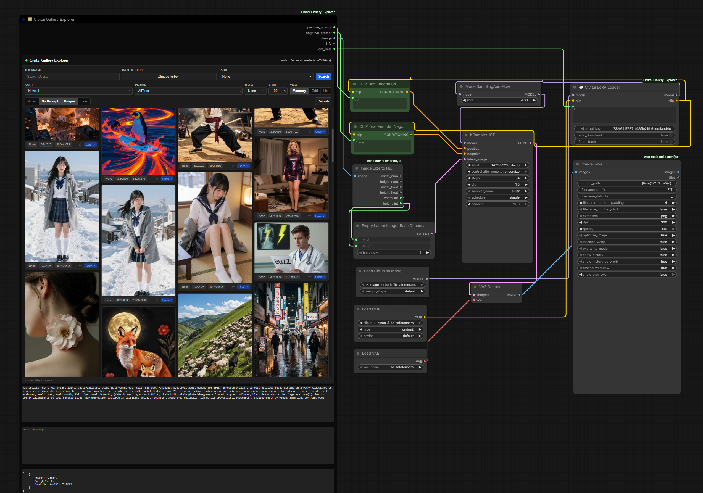

# CivitAI Gallery Explorer for ComfyUI

**CivitAI Gallery Explorer** is a powerful custom node for ComfyUI that brings the full Civitai browsing experience directly into your workflow. Explore models, images, and videos with an infinite scroll interface, advanced filters, and seamless integration for prompts and LoRAs.



## ✨ Features

- **Infinite Scroll Gallery**: Browse thousands of images and models without pagination.
- **Advanced Filtering**: Filter by NSFW level, Time Period (Day/Week/Month/Year/AllTime), Sort Order (Newest/Most Reactions/Most Comments), and Media Type (Images/Videos).
- **Native UI Integration**: Fully responsive masonry grid layout that adapts to your node size.
- **Drag & Drop Workflow**: Drag images directly from the gallery to your canvas to load their workflows (if available) or use them as inputs.
- **Metadata Inspector**: View full generation metadata including prompts, negative prompts, Sampler, CFG, Seed, and Model details.
- **Auto-Download LoRAs**: Automatically detects missing LoRAs in the metadata and offers to download them with a single click (or auto-download enabled).
- **Favorites System**: Save your favorite images locally to a "Favorites" tab for quick access.
- **Search & Discovery**: Search by username, tag, or base model (SD 1.5, SDXL, Pony, etc.).
- **Smart Inputs**: Automatically populates `positive_prompt`, `negative_prompt`, and `lora_data` widgets when an image is selected.

## 🚀 Installation

### Option 1: ComfyUI Manager (Recommended)

1. Open **ComfyUI Manager**.
2. Click **Install Custom Nodes**.
3. Search for `CivitAI Gallery Explorer`.
4. Click **Install**.
5. Restart ComfyUI.

### Option 2: Manual Installation

1. Navigate to your ComfyUI `custom_nodes` directory:
   ```bash
   cd ComfyUI/custom_nodes/
   ```
2. Clone this repository:
   ```bash
   git clone https://github.com/fabwaseem/ComfyUI-Civitai-Gallery-Explorer.git
   ```
3. Install dependencies:
   ```bash
   cd ComfyUI-Civitai-Gallery-Explorer
   pip install -r requirements.txt
   ```
4. Restart ComfyUI.

## 🛠️ Usage

1. **Add the Node**: Right-click on the canvas -> `fabwaseem/Civitai` -> `Civitai Gallery Explorer`.
2. **Browse**: Use the filters and search bar to find content.
3. **Select**: Click on an image to view its details.
4. **Use**:
   - The `positive_prompt` and `negative_prompt` widgets will automatically update.
   - Connect the `lora_data` output to a LoRA loader stack (compatible with standard LoRA stack formats) to auto-load used LoRAs.
   - Enable "Auto Download" in the LoRA Loader node to fetch missing resources automatically.

## 🧩 Example Workflow

Download the example workflow JSON file to get started quickly:

[Download Example Workflow](assets/example-workflow.json)

## ⚙️ Configuration

- **NSFW Filter**: Toggle between None, Soft, Mature, and X.
- **View Mode**: Switch between Masonry (Grid) and List view.
- **Video Support**: Toggle video playback in the gallery.
- **Favorites**: Click the star icon on any image to add it to your favorites list.

## 🤝 Contributing

Contributions are welcome! Please feel free to submit a Pull Request.

## 📄 License

This project is licensed under the MIT License - see the [LICENSE](LICENSE) file for details.

## 🙏 Credits

Developed by **Waseem Anjum** (fabwaseem).
